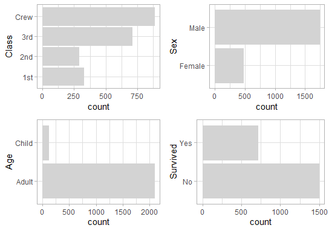
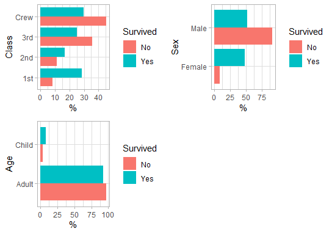
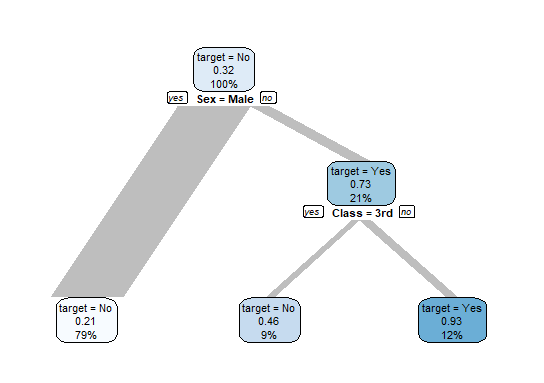

{explore} simplifies Exploratory Data Analysis (EDA) ... now you can use {explore} with count-data too!

## What are count-data?

Data are stored in tables most of the time. This data is called **tidy** if:

* Each row is an observation
* Each column is a variable
* Each cell is a value

So in a tidy Titanic-dataset each row is representing a person on the ship. 
Each column is representing a variable (like age or gender). And each cell is representing a value (like gender of a specific person is "Male")

```R
titanic_tidy
```
```
# A tibble: 2,201 x 5
      id Class Sex   Age   Survived
   <int> <fct> <fct> <fct> <fct>   
 1     1 3rd   Male  Child No      
 2     2 3rd   Male  Child No      
 3     3 3rd   Male  Child No      
 4     4 3rd   Male  Child No      
 5     5 3rd   Male  Child No      
 6     6 3rd   Male  Child No      
 7     7 3rd   Male  Child No      
 8     8 3rd   Male  Child No      
 9     9 3rd   Male  Child No      
10    10 3rd   Male  Child No      
# ... with 2,191 more rows
```

We see that the first 10 observations are similar except the id. So the basic idea of having count-data is, to group all similar observations and add a count variable. Let's use the Titanic dataset that comes with Base R:

```R
library(tidyverse)
titanic <- as_tibble(Titanic)
```
```
# A tibble: 32 x 5
   Class Sex    Age   Survived     n
   <chr> <chr>  <chr> <chr>    <dbl>
 1 1st   Male   Child No           0
 2 2nd   Male   Child No           0
 3 3rd   Male   Child No          35
 4 Crew  Male   Child No           0
 5 1st   Female Child No           0
 6 2nd   Female Child No           0
 7 3rd   Female Child No          17
 8 Crew  Female Child No           0
 9 1st   Male   Adult No         118
10 2nd   Male   Adult No         154
# ... with 22 more rows
```

Now we have a table with just 32 rows instead of 2201 (14.5%) without any lost of information! 

**Count-data**:

* Each row is a group of observations with similar attributes 
* One column is a numeric variable representign the number of observations 
* The rest of the columns are categorical variables
* Each cell is a value

So, what is the benefit of using count-data instead of tidy-data? For the Titanic-data it may not make much a difference, 
but if you think of a dataset with millions of observations but low number of variables or low variation in the data, using count data will save a lot of memory and disk space and you will let explore the data much faster!

## Describe count-data

We can use {explore} to take a closer look to the data:

```R
library(tidyverse)
library(explore)
titanic <- as_tibble(Titanic)
titanic %>% describe()
```
```
# A tibble: 5 x 8
  variable type     na na_pct unique   min  mean   max
  <chr>    <chr> <int>  <dbl>  <int> <dbl> <dbl> <dbl>
1 Class    chr       0      0      4    NA  NA      NA
2 Sex      chr       0      0      2    NA  NA      NA
3 Age      chr       0      0      2    NA  NA      NA
4 Survived chr       0      0      2    NA  NA      NA
5 n        dbl       0      0     22     0  68.8   670
```

Thera are 5 variables in the data, the variable n is representing the number of the observations.
To take a look at the "uncounted" data, we can simply:

```R
titanic %>% describe_tbl(n = n)
```
```
2 201 (2.2k) observations with 5 variables
0 observations containing missings (NA)
0 variables containing missings (NA)
0 variables with no variance
```
We see that the 32 rows of the data contains 2201 observations and 5 variables (one is containing the number of observations)

## Explore count-data

We can visually explore a variable of the count-data simply using the explore function:

```R
titanic %>% 
  explore(Age, n = n)
```
we can visually explore the relationship between a variable and a target:

```R
titanic %>% 
  explore(Age, target = Survived, n = n)
```

We can even explore all variables in one line of code:

```R
titanic %>% 
  explore_all(n = n)
```



```R
titanic %>% 
  explore_all(target = Survived, n = n)
```



## Report count-data

We can generate a rich HTML-report with just one line of code:

```R
titanic %>% 
  report(n = n, output_dir = tempdir())
```
[View report:] (https://htmlpreview.github.io/?https://github.com/rolkra/rolkra.github.io/blob/master/images/report_variable.html)

To get a reoprt the relationship between all variables and a target:

```R
titanic %>% 
  report(target = Survived, n = n, output_dir = tempdir())
```

[View report:] (https://htmlpreview.github.io/?https://github.com/rolkra/rolkra.github.io/blob/master/images/report_target_split.html)

## Explain a target

We can create a simple decision tree to explain a target (in our case Survived)

```R
titanic %>% 
  explain_tree(target = Survived, n = n)
```


So, overall 32% of the people survived. 

Splitting by target already shows a strong pattern: 21% of male survived, but 73% of female. Taking a closer look to females, we see that better classes hat better chances to survive (46% of 3rd class survived, but 93% of better classes)
